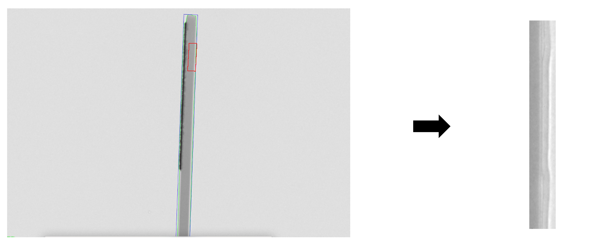

## Overview
Facial keypoints detection 모델을 기반으로 CT Image 내 관심 있는 포인트를 detection하는 모델을 개발중입니다.
U Net-based Heatmap regression으로 진행합니다.

## Data
데이터는 원본 데이터에서 필요한 부분을 OpenCV 함수를 통해 crop하여 (512,64,1)의 크기로 저장합니다.
사용 데이터 특성상 특징이 없고 경계가 모호한 면이 있어 Edge detection을 진행하고 원본 이미지와 합성합니다.

해당 이미지에서 두 개의 keypoint를 detection합니다.